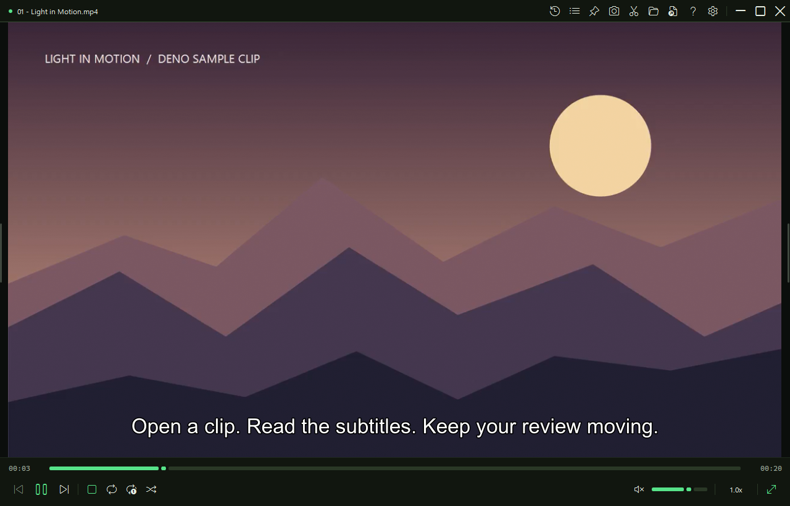
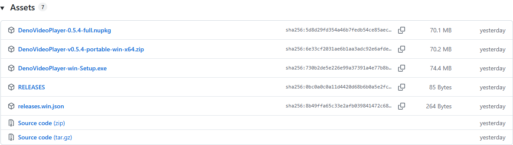
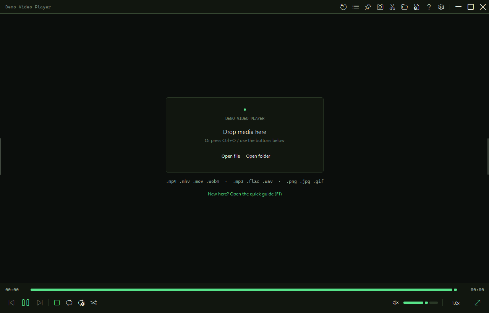
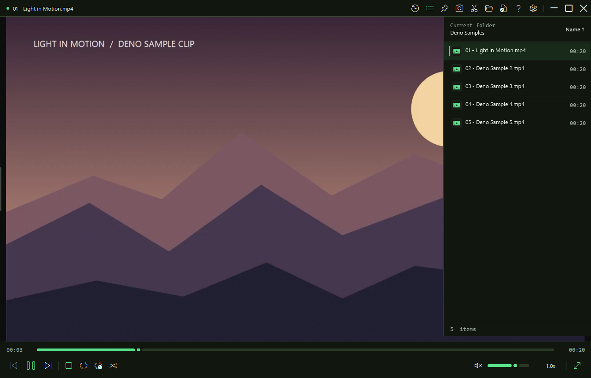
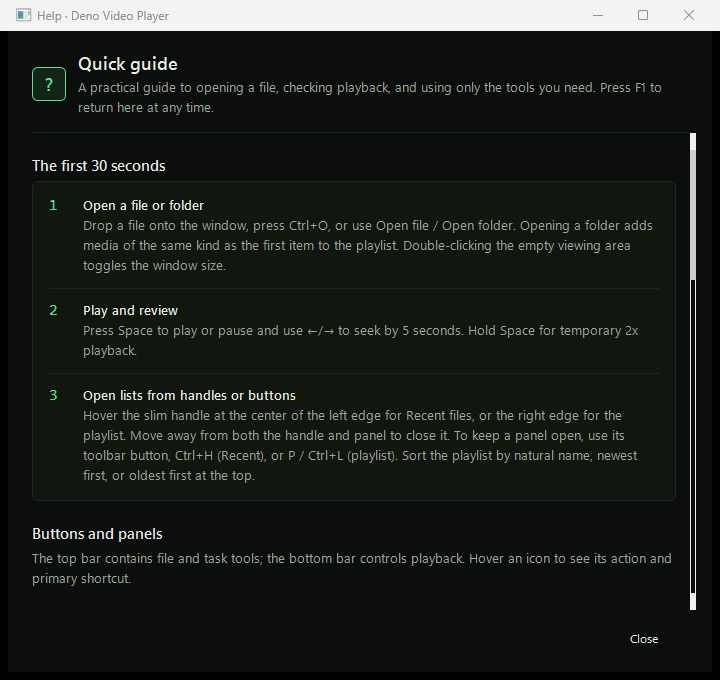
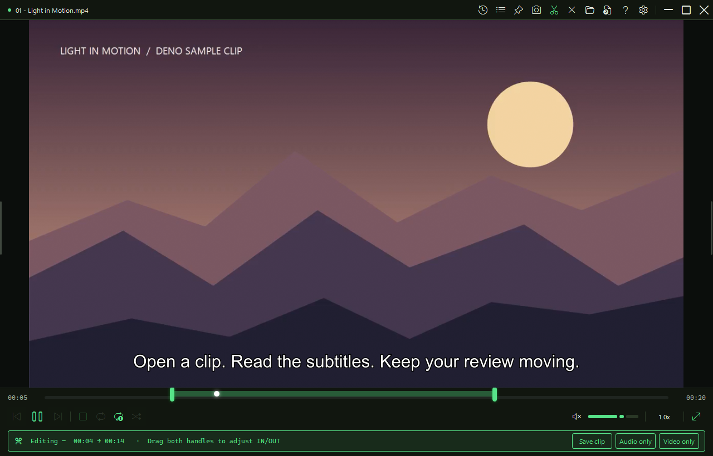
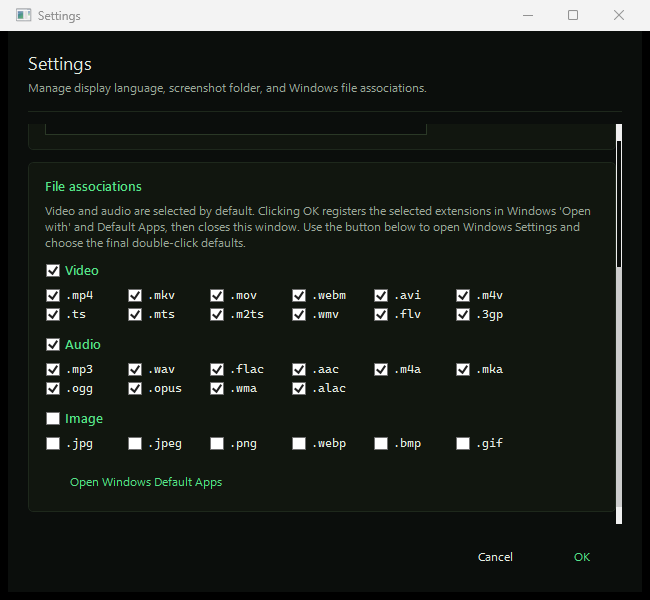

# Deno Video Player

<p align="center">
  
</p>

English | [Korean](docs/README.ko.md) | [Japanese](docs/README.ja.md) | [Simplified Chinese](docs/README.zh-CN.md) | [Spanish](docs/README.es.md) | [Portuguese (Portugal)](docs/README.pt-PT.md) | [Portuguese (Brazil)](docs/README.pt-BR.md) | [Indonesian](docs/README.id.md)

**A focused Windows player for opening local video, audio, images, and subtitles without ads, accounts, cloud sync, or telemetry.**

[Download the recommended Windows installer](https://github.com/Deno2026/deno-video-player/releases/download/v0.5.4/DenoVideoPlayer-win-Setup.exe) · [Open the latest release page](https://github.com/Deno2026/deno-video-player/releases/latest)

**Latest stable:** [v0.5.4](https://github.com/Deno2026/deno-video-player/releases/tag/v0.5.4) · Published September 7, 2026 · Windows 10/11 x64



This page starts with the easiest installation path for beginners, then explains the player screen, common tasks, shortcuts, updates, and troubleshooting.

## Contents

- [Install for the first time](#install-for-the-first-time)
- [First launch](#first-launch)
- [Play your first file](#play-your-first-file)
- [Know the player screen](#know-the-player-screen)
- [Use the main features](#use-the-main-features)
- [Settings and file associations](#settings-and-file-associations)
- [Automatic updates](#automatic-updates)
- [Portable version](#portable-version)
- [Supported files and shortcuts](#supported-files-and-shortcuts)
- [Troubleshooting](#troubleshooting)

## Install for the First Time

### What to download

For a normal installation, download only:

**`DenoVideoPlayer-win-Setup.exe`**

Open [the latest Releases page](https://github.com/Deno2026/deno-video-player/releases/latest), expand **Assets**, and select the file with that exact name.



The other files have different purposes:

| File | Who needs it? |
| --- | --- |
| `DenoVideoPlayer-win-Setup.exe` | Recommended for almost everyone. Installs the app and creates shortcuts. |
| `DenoVideoPlayer-v0.5.4-portable-win-x64.zip` | For people who specifically want a portable copy and are comfortable extracting ZIP files. |
| `.nupkg`, `RELEASES`, `releases.win.json` | Used by the automatic updater. Do not download these for a normal installation. |
| Source code archives | For developers who want to inspect or build the source. |

### Step-by-step installation

1. Select the installer link above and allow the download to finish.
2. Open your **Downloads** folder and double-click `DenoVideoPlayer-win-Setup.exe`.
3. The installer places Deno Video Player in your Windows user account and creates Desktop and Start menu shortcuts. There is no archive to extract and no install folder to choose.
4. If Windows SmartScreen shows an unrecognized-app warning, first verify that the file came from `github.com/Deno2026/deno-video-player`. If you trust that official download, select **More info** and then **Run anyway**.
5. Open **Deno Video Player** from the Desktop shortcut or Start menu.

The installer is not code-signed yet, so SmartScreen may appear on some PCs. Do not disable Windows security, and do not continue if Windows reports malware rather than an unrecognized publisher.

Current v0.5.4 installer SHA-256:

```text
730B2DE5E226E99A37391A4E77B8B483F92176F2AE2C0735423016D2140664B5
```

No account, product key, separate codec pack, or manual extraction is required.

## First Launch

Keep the PC connected to the internet on the first launch. Deno Video Player prepares the mpv playback engine automatically. This can take a little time depending on the connection; leave the player open until the ready screen appears.



New settings currently start with the Korean interface. If the first window is not in English:

1. Select the gear icon near the top-right corner.
2. Select **English** in the language section.
3. Select the confirmation button at the bottom-right of the Settings window.

The next launch will remember the selected language.

The first clip, audio-only, or video-only export also needs internet access once, because the app prepares FFmpeg on demand. Normal playback does not upload your files.

## Play Your First File

The quickest method is to drag a video, audio file, or image from File Explorer and drop it anywhere inside the player.

You can also:

- select **Open file** in the empty player
- select the file icon in the top bar
- press `Ctrl + O`
- select **Open folder** to open the first supported item in a folder; that item's video, audio, or image type becomes the playlist type
- double-click a file in File Explorer after you have chosen Deno Video Player as its Windows default app

After opening a file:

1. Press `Space` to play or pause.
2. Press `Left` or `Right` to seek by 5 seconds.
3. Hold `Shift` with `Left` or `Right` to seek by 30 seconds.
4. Hold `Space` for temporary 2x playback, then release it to return to the previous speed.
5. Press `F1` whenever you want the built-in quick guide.

## Know the Player Screen

### Top bar

The top bar keeps file and task tools together. Hover any icon to see its name and primary shortcut.

From left to right in the tool group:

| Tool | What it does |
| --- | --- |
| Recent | Opens recently used files. Shortcut: `Ctrl + H`. |
| Playlist | Opens media from the current folder. Shortcuts: `P` or `Ctrl + L`. |
| Pin | Toggles Always on top. Shortcut: `Ctrl + T`. |
| Camera | Saves a screenshot of the current video or image. Shortcut: `Ctrl + S`. |
| Scissors | Enters clip range editing. |
| Folder | Opens a folder and builds a playlist. |
| File | Opens one file. Shortcut: `Ctrl + O`. |
| Question mark | Opens the built-in guide. Shortcut: `F1`. |
| Gear | Opens language, screenshot-folder, and Windows file-association settings. |

An update icon appears only when a newer public version is available.

### Bottom bar

The timeline shows the current time, total duration, and seek position. The lower-left controls provide previous, play/pause, next, repeat off, repeat all, repeat one, and shuffle. The lower-right controls provide mute, volume, playback speed, hide-controls in fullscreen, and fullscreen/restore.

The **fullscreen/restore** button changes window size. While already in fullscreen, a separate **hide controls** button immediately hides the bars without changing the window size. Moving the pointer or pressing a key shows the controls again.

### Left and right edge handles

Move the pointer near the slim handle in the center of the left edge to preview **Recent files**. Use the matching right-edge handle for the **current-folder playlist**. A hover-opened panel closes shortly after you move away from both the handle and panel.

Panels opened with the top button or keyboard shortcut stay open until you close them or switch panels.



The playlist can be sorted by natural file name, newest first, or oldest first. The chosen order is remembered and also controls previous/next navigation. With **newest first**, `Next` or `Ctrl + Right` moves down the list toward older files.

### Built-in guide

Select the question mark or press `F1` to open the full in-app guide. It covers first use, buttons, panels, shortcuts, tracks, zoom, screenshots, clip export, and common recovery steps.



## Use the Main Features

### Browse files in the same folder

Opening one media file builds a simple playlist from supported files of the **same type** in that folder: video with video, audio with audio, or image with image. Previous and next therefore do not unexpectedly jump between those three types.

When you use **Open folder**, the first supported item in the current sort order is opened, and its type determines which other files enter the playlist. If a folder mixes videos, audio, and images, open the specific file you want instead when you need a different type.

- Previous file: `PageUp` or `Ctrl + Left`
- Next file: `PageDown` or `Ctrl + Right`
- Open or close the playlist: `P` or `Ctrl + L`
- Open or close Recent files: `Ctrl + H`

Very large folders can take longer to populate. The lists use virtualization so only visible rows are rendered.

### Fullscreen and window size

The following inputs share the same window-size action:

- `F`, `F11`, `Enter`, or `Alt + Enter`
- double-click the viewing area
- double-click the title bar
- the size button at the upper-right or lower-right

A normal window enters fullscreen. Fullscreen or a Windows-maximized window returns to its previous normal size. Press `Esc` to leave fullscreen. During clip editing, the first `Esc` cancels the edit instead.

### Zoom and move the video

- Hold `Ctrl` and turn the mouse wheel to zoom in or out.
- After zooming in, drag with the middle mouse button to move the image.
- Continue zooming out to return to the fitted view.

Normal mouse-wheel movement changes volume when `Ctrl` is not held.

### Screenshots

Press `Ctrl + S` or select the camera icon while a video or image is open. Screenshots are saved by default to:

```text
Pictures\Deno Video Player
```

You can choose another folder in Settings. Audio files cannot produce a screenshot.

### Subtitles and audio tracks

To add an external subtitle, open the video first and then drop the subtitle file onto the player.

- Next subtitle track: `V`
- Show or hide subtitles: `Shift + V`
- Next audio track: `Ctrl + J`

### Frame stepping and speed

- Previous frame: `,`
- Next frame: `.`
- Decrease speed by 0.25: `Shift + ,`
- Increase speed by 0.25: `Shift + .`
- Open speed presets: select the speed value, such as `1.0x`
- Change speed by 0.25: turn the wheel while the pointer is over the speed value

### Save a clip, audio only, or video only

1. Select the scissors icon to enter editing mode.
2. Press `I` for the IN point and `O` for the OUT point, or drag the two range handles.
3. Choose **Save clip**, **Audio only**, or **Video only**.
4. Use `X` to clear the points, or `Esc` to cancel without saving.

`Ctrl + E` saves the selected clip range.



Exports use FFmpeg stream copy. This is fast and does not re-encode the media, but the saved start or end can move slightly to a nearby keyframe. The first export may require a relatively large FFmpeg download.

## Settings and File Associations

Settings manages the interface language, screenshot folder, and which file types Deno Video Player advertises to Windows.



Changing a checkbox does not silently replace your Windows default apps. Windows requires you to confirm the default app yourself.

For the most reliable beginner workflow, open files with drag and drop or `Ctrl + O`. If you want double-click opening from File Explorer:

1. Open the gear icon in Deno Video Player.
2. Select the video or audio extensions you want to register. Image formats are optional.
3. Select **Open Windows Default Apps** inside Settings. This saves and registers the selected extensions, then opens the Windows Settings page.
4. Confirm Deno Video Player for each extension in Windows.

You can also right-click a file in File Explorer, choose **Open with**, and select Deno Video Player.

Known v0.5.4 limitation: Windows may show more than one identical Deno Video Player choice. If double-click opening still fails, launch the player from its Desktop or Start menu shortcut and use drag and drop or `Ctrl + O`. This affects the Windows association path, not playback after a file is opened.

## Automatic Updates

The installed version checks the official GitHub release feed after launch and periodically while it remains open.

- Nothing is installed silently.
- When a newer version exists, the player shows an update prompt first.
- The download begins only after you choose **Update**.
- After applying the update, the installed app restarts automatically.
- If v0.5.4 is still the latest version, no prompt appears.

The portable version cannot replace itself through the installed-app updater. Its update action opens the latest Releases page so you can download a new portable ZIP.

## Portable Version

Choose the portable build only if you specifically do not want a normal installation:

1. Download `DenoVideoPlayer-v0.5.4-portable-win-x64.zip` from [the v0.5.4 release](https://github.com/Deno2026/deno-video-player/releases/tag/v0.5.4).
2. Extract the entire ZIP into a writable folder.
3. Run `DenoVideoPlayer.exe` from the extracted folder.

Do not run the executable from inside the ZIP viewer. Keep all extracted files together. For most beginners, the Setup installer is simpler.

## Supported Files and Shortcuts

### System requirements

- Windows 10 or Windows 11, x64
- Internet access on first launch to prepare mpv
- Internet access on first clip/audio/video export to prepare FFmpeg
- macOS and Linux are not currently supported

### Supported formats

- **Video:** `.mp4 .mkv .mov .webm .avi .m4v .ts .mts .m2ts .wmv .flv .3gp`
- **Audio:** `.mp3 .wav .flac .aac .m4a .mka .ogg .opus .wma .alac`
- **Image:** `.jpg .jpeg .png .webp .bmp .gif`
- **Subtitles:** `.srt .ass .ssa .vtt .sub .idx .sup .smi`

Container support does not guarantee that every codec inside every file will decode. If one file fails, test a second known-good file.

### Complete everyday shortcut list

| Action | Shortcut |
| --- | --- |
| Open file | `Ctrl + O` |
| Play / pause | Tap `Space` |
| Temporary 2x playback | Hold `Space` |
| Seek 5 seconds | `Left` / `Right` |
| Seek 30 seconds | `Shift + Left` / `Shift + Right` |
| Previous / next file of the same kind | `PageUp` / `PageDown` or `Ctrl + Left` / `Ctrl + Right` |
| Volume | `Up` / `Down` or mouse wheel |
| Mute | `M` |
| Video zoom / pan | `Ctrl + mouse wheel` / middle-button drag |
| Previous / next frame | `,` / `.` |
| Speed down / up by 0.25 | `Shift + ,` / `Shift + .` |
| Fullscreen / restore | `F`, `F11`, `Enter`, `Alt + Enter`, or double-click the viewing area/title bar |
| Leave fullscreen | `Esc` |
| Recent files | `Ctrl + H` |
| Current-folder playlist | `P` or `Ctrl + L` |
| Screenshot | `Ctrl + S` |
| Always on top | `Ctrl + T` |
| Next subtitle / show-hide subtitles | `V` / `Shift + V` |
| Next audio track | `Ctrl + J` |
| Set IN / OUT point | `I` / `O` |
| Clear trim points | `X` |
| Save clip range | `Ctrl + E` |
| Help and shortcuts | `F1` |

## Troubleshooting

### The playback engine is still preparing

Leave the app open and check the internet connection. If preparation fails, use **Retry playback engine** on the failure screen. If it repeatedly fails, restart the player or download a fresh official installer or portable archive.

### One file does not play

Open a different known-good MP4 or MP3. If the second file works, the first file may be damaged or use an unsupported codec. If every file fails, restart the app and check the playback-engine message in the player.

### A subtitle file does nothing

Open its video first, then drag the subtitle file into the player. Confirm that the subtitle track is selected with `V`, and that subtitles are visible with `Shift + V`.

### Export fails the first time

The first export prepares FFmpeg. Check the internet connection, leave the app open until preparation finishes, and retry. Also confirm that the destination folder is writable and has enough free space.

### Double-clicking a media file opens another app

Installation does not forcefully change Windows defaults. Follow [Settings and file associations](#settings-and-file-associations), or use drag and drop / `Ctrl + O`.

### No update prompt appears

That normally means the installed version is already current. Compare the version on [the latest release page](https://github.com/Deno2026/deno-video-player/releases/latest). Portable builds open that page instead of self-replacing.

### Where are the logs?

The diagnostic log is stored at:

```text
%APPDATA%\DenoVideoPlayer\log.txt
```

When reporting a reproducible problem, include the Windows version, Deno Video Player version, file extension, the steps that caused it, and the relevant end of the log. Do not upload private media unless you intend to share it.

Please report reproducible problems through [GitHub Issues](https://github.com/Deno2026/deno-video-player/issues).

### How do I uninstall it?

Open **Windows Settings → Apps → Installed apps**, find **Deno Video Player**, and choose **Uninstall**. Your personal screenshots and media files are not removed.

## Privacy and Network Use

Deno Video Player plays local media locally. It has no ads, account system, cloud sync, analytics, recommendations, store, plugin marketplace, AI features, or background media-library indexing.

Network access is used only for practical product operations:

- checking the official GitHub feed for a newer version
- downloading an update after you approve it
- preparing mpv on first launch
- preparing FFmpeg on the first export

## Developer Notes and License

```powershell
dotnet restore DenoVideoPlayer.sln
dotnet test .\DenoVideoPlayer.sln --configuration Release
dotnet publish .\DenoVideoPlayer.csproj -c Release -r win-x64 --self-contained true -o .\publish\DenoVideoPlayer-win-x64
```

See [CHANGELOG.md](CHANGELOG.md) for user-facing changes.

Deno Video Player source code is released under [GNU GPL v3.0](LICENSE) (`GPL-3.0-only`). You may use, study, modify, and redistribute it, including commercially. Distributed modified versions must follow GPL-3.0 and preserve the required license and copyright notices.

Third-party components such as mpv, FFmpeg, Velopack, and 7-Zip remain under their own licenses. See [NOTICE.md](NOTICE.md).
