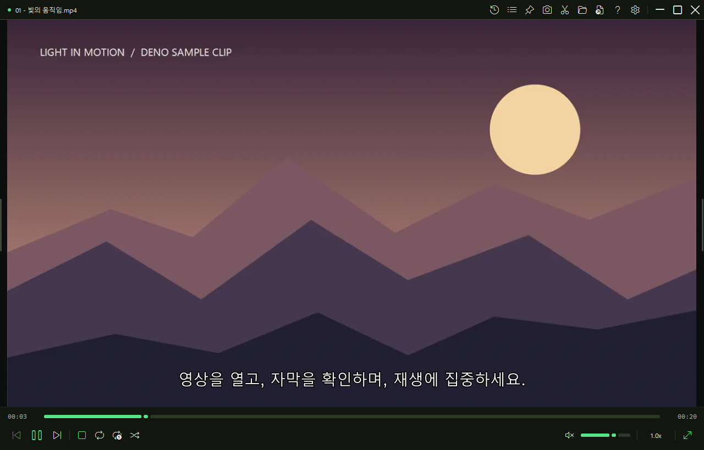
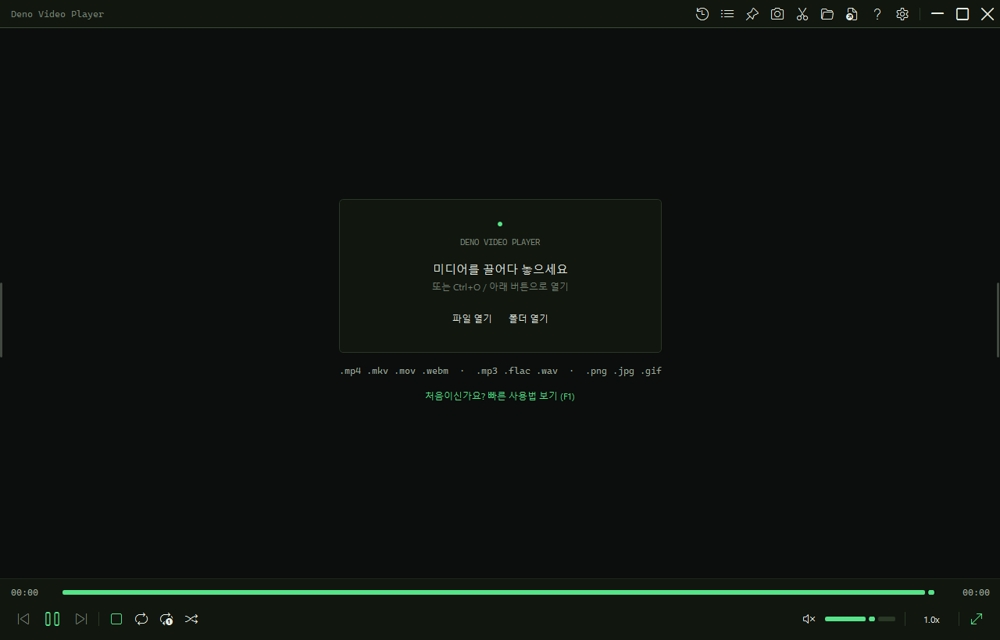
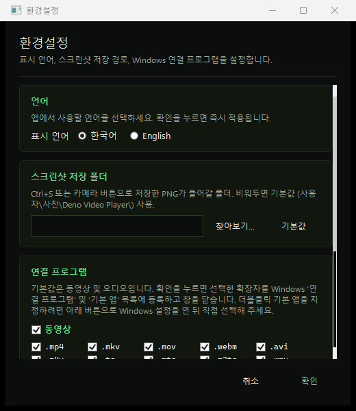
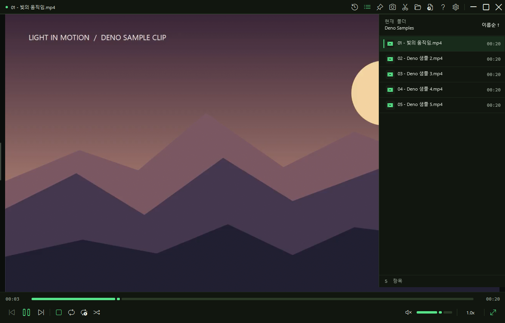
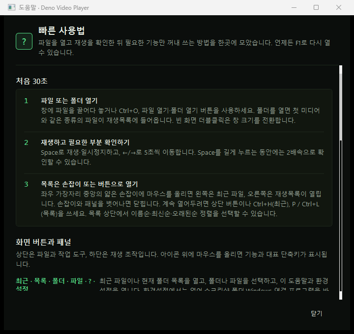
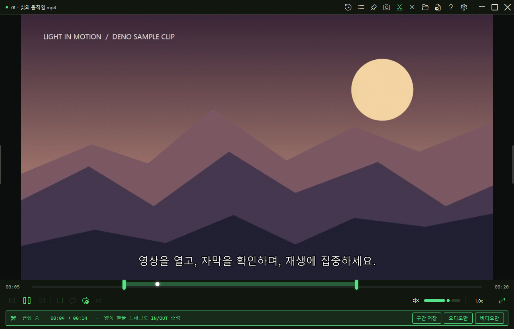
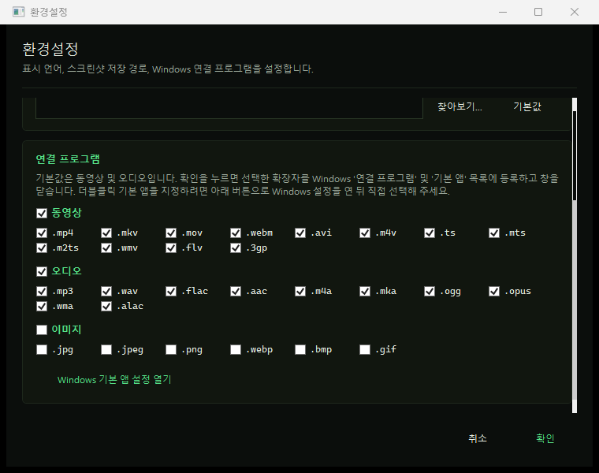

# Deno Video Player

[English](../README.md) | 한국어 | [日本語](README.ja.md) | [简体中文](README.zh-CN.md) | [Español](README.es.md) | [Português (Portugal)](README.pt-PT.md) | [Português (Brasil)](README.pt-BR.md) | [Bahasa Indonesia](README.id.md)

**광고·계정·클라우드 동기화·사용 추적 없이 로컬 영상, 오디오, 이미지, 자막을 여는 데 집중한 Windows 플레이어입니다.**

[초보자용 Windows 설치 파일 바로 받기](https://github.com/Deno2026/deno-video-player/releases/download/v0.5.4/DenoVideoPlayer-win-Setup.exe) · [최신 릴리스 페이지 열기](https://github.com/Deno2026/deno-video-player/releases/latest)

**최신 안정 버전:** [v0.5.4](https://github.com/Deno2026/deno-video-player/releases/tag/v0.5.4) · 2026년 9월 7일 공개 · Windows 10/11 64비트



이 문서는 처음 설치하는 분이 그대로 따라 할 수 있도록 다운로드부터 첫 재생, 화면 구성, 주요 기능, 단축키, 업데이트, 문제 해결까지 순서대로 설명합니다.

## 목차

- [처음 설치하기](#처음-설치하기)
- [첫 실행](#첫-실행)
- [첫 파일 재생하기](#첫-파일-재생하기)
- [화면 구성 익히기](#화면-구성-익히기)
- [주요 기능 사용하기](#주요-기능-사용하기)
- [환경설정과 연결 프로그램](#환경설정과-연결-프로그램)
- [자동 업데이트](#자동-업데이트)
- [포터블 버전](#포터블-버전)
- [지원 파일과 단축키](#지원-파일과-단축키)
- [문제 해결](#문제-해결)

## 처음 설치하기

### 어떤 파일을 받아야 하나요?

일반적인 설치라면 아래 파일 하나만 받으세요.

**`DenoVideoPlayer-win-Setup.exe`**

[최신 Releases 페이지](https://github.com/Deno2026/deno-video-player/releases/latest)를 열고 **Assets**를 펼친 다음, 이름이 정확히 같은 파일을 누르세요.


나머지 파일은 용도가 다릅니다.

| 파일 | 용도 |
| --- | --- |
| `DenoVideoPlayer-win-Setup.exe` | 대부분의 사용자에게 추천합니다. 앱을 설치하고 바로가기를 만듭니다. |
| `DenoVideoPlayer-v0.5.4-portable-win-x64.zip` | 설치하지 않고 쓰려는 분을 위한 압축본입니다. 직접 압축을 풀어야 합니다. |
| `.nupkg`, `RELEASES`, `releases.win.json` | 자동 업데이트가 사용하는 파일입니다. 일반 설치용으로 받지 마세요. |
| Source code 압축 파일 | 소스 코드를 확인하거나 직접 빌드할 개발자용입니다. |

### 설치 순서

1. 위의 설치 파일 링크를 누르고 다운로드가 끝날 때까지 기다립니다.
2. **다운로드** 폴더에서 `DenoVideoPlayer-win-Setup.exe`를 더블클릭합니다.
3. 설치 프로그램이 현재 Windows 사용자 계정에 Deno Video Player를 설치하고 바탕화면과 시작 메뉴에 바로가기를 만듭니다. 압축을 풀거나 설치 폴더를 고를 필요는 없습니다.
4. Windows SmartScreen에서 ‘인식할 수 없는 앱’ 경고가 나오면 파일을 받은 주소가 `github.com/Deno2026/deno-video-player`인지 먼저 확인하세요. 공식 파일을 신뢰하는 경우에만 **추가 정보 → 실행**을 선택합니다.
5. 바탕화면 또는 시작 메뉴의 **Deno Video Player**를 실행합니다.

현재 설치 파일은 아직 코드 서명되지 않아 일부 PC에서 SmartScreen이 나타날 수 있습니다. Windows 보안 기능을 끌 필요는 없으며, ‘알 수 없는 게시자’가 아니라 악성코드 탐지 경고가 나온다면 진행하지 마세요.

현재 v0.5.4 설치 파일의 SHA-256:

```text
730B2DE5E226E99A37391A4E77B8B483F92176F2AE2C0735423016D2140664B5
```

회원가입, 제품 키, 별도 코덱팩 설치, 수동 압축 해제는 필요 없습니다.

## 첫 실행

처음 실행할 때는 인터넷에 연결해 두세요. Deno Video Player가 mpv 재생 엔진을 자동으로 준비합니다. 인터넷 속도에 따라 시간이 조금 걸릴 수 있으므로 준비 완료 화면이 나올 때까지 창을 닫지 말고 기다려 주세요.



새 설정의 기본 화면은 한국어입니다. 다른 언어로 열렸다면 우측 상단의 톱니바퀴를 누르고 **한국어**를 선택한 다음 환경설정 오른쪽 아래의 확인 버튼을 누르세요. 다음 실행부터 선택한 언어가 유지됩니다.



처음으로 구간·오디오만·비디오만 저장할 때도 FFmpeg를 한 번 준비하므로 인터넷 연결이 필요합니다. 일반 재생 과정에서 사용자의 미디어 파일을 업로드하지 않습니다.

## 첫 파일 재생하기

가장 쉬운 방법은 파일 탐색기에서 영상, 오디오 또는 이미지 파일을 잡아 플레이어 창 안으로 끌어다 놓는 것입니다.

다른 방법도 있습니다.

- 빈 플레이어의 **파일 열기** 누르기
- 상단의 파일 아이콘 누르기
- `Ctrl + O` 누르기
- **폴더 열기**로 폴더의 첫 지원 파일을 열기. 그 파일의 영상·오디오·이미지 종류가 재생목록의 종류가 됩니다.
- Windows 기본 앱을 Deno Video Player로 지정한 뒤 탐색기에서 파일 더블클릭하기

파일을 연 다음에는 아래 순서만 알아도 바로 사용할 수 있습니다.

1. `Space`로 재생하거나 일시정지합니다.
2. `←` / `→`로 5초씩 이동합니다.
3. `Shift + ←` / `Shift + →`로 30초씩 이동합니다.
4. `Space`를 길게 누르는 동안만 2배속으로 확인하고, 손을 떼면 이전 속도로 돌아옵니다.
5. 사용법이 기억나지 않으면 언제든 `F1`을 누릅니다.

## 화면 구성 익히기

### 상단 도구 모음

상단에는 파일과 작업 도구가 모여 있습니다. 아이콘 위에 마우스를 올리면 기능 이름과 대표 단축키가 표시됩니다.

도구 그룹의 왼쪽부터 기능은 다음과 같습니다.

| 도구 | 기능 |
| --- | --- |
| 최근 | 최근 사용한 파일을 엽니다. 단축키: `Ctrl + H` |
| 재생목록 | 현재 폴더의 미디어 목록을 엽니다. 단축키: `P` 또는 `Ctrl + L` |
| 핀 | 창을 항상 위에 표시합니다. 단축키: `Ctrl + T` |
| 카메라 | 현재 영상 또는 이미지를 캡처합니다. 단축키: `Ctrl + S` |
| 가위 | 구간 편집 모드로 들어갑니다. |
| 폴더 | 폴더를 열어 재생목록을 만듭니다. |
| 파일 | 파일 하나를 엽니다. 단축키: `Ctrl + O` |
| 물음표 | 앱 안의 빠른 사용법을 엽니다. 단축키: `F1` |
| 톱니바퀴 | 언어, 캡처 폴더, Windows 연결 프로그램 설정을 엽니다. |

새 공개 버전이 있을 때만 업데이트 아이콘이 추가로 나타납니다.

### 하단 재생 조작부

진행 막대에는 현재 시간, 전체 길이, 재생 위치가 표시됩니다. 왼쪽에는 이전, 재생/일시정지, 다음, 반복 없음, 전체 반복, 한 항목 반복, 셔플이 있습니다. 오른쪽에는 음소거, 음량, 배속, 전체화면에서 컨트롤 숨기기, 전체화면/복귀 버튼이 있습니다.

**전체화면/복귀** 버튼은 창 크기를 바꿉니다. 이미 전체화면일 때 나타나는 별도의 **컨트롤 숨기기** 버튼은 창 크기를 유지한 채 상·하단 조작부만 바로 숨깁니다. 마우스를 움직이거나 키를 누르면 컨트롤이 다시 나타납니다.

### 좌우 중앙 손잡이

왼쪽 가장자리 중앙의 얇은 손잡이 근처에 마우스를 가져가면 **최근 파일**이 열립니다. 오른쪽 손잡이는 **현재 폴더 재생목록**을 엽니다. 마우스가 손잡이와 패널을 모두 벗어나면 잠시 후 빠르게 닫힙니다.

상단 버튼이나 단축키로 연 패널은 직접 닫거나 다른 패널로 바꿀 때까지 열린 상태를 유지합니다.



재생목록은 이름순, 최신순, 오래된순으로 정렬할 수 있습니다. 선택한 정렬은 기억되며 이전/다음 파일 이동 순서에도 그대로 적용됩니다. **최신순**일 때 `다음` 또는 `Ctrl + →`를 누르면 목록 아래쪽의 더 오래된 파일로 이동합니다.

### 앱 안의 빠른 사용법

물음표 버튼이나 `F1`을 누르면 전체 빠른 사용법이 열립니다. 첫 사용, 버튼, 패널, 단축키, 자막과 오디오 트랙, 확대, 캡처, 구간 저장, 문제 해결을 한곳에서 볼 수 있습니다.



## 주요 기능 사용하기

### 같은 폴더의 파일 둘러보기

미디어 파일 하나를 열면 같은 폴더에서 **같은 종류**인 지원 파일로 간단한 재생목록을 만듭니다. 영상은 영상끼리, 오디오는 오디오끼리, 이미지는 이미지끼리 이동하므로 갑자기 다른 종류로 바뀌지 않습니다.

**폴더 열기**를 사용하면 현재 정렬 기준의 첫 지원 파일이 열리고, 그 파일의 종류에 맞는 파일만 재생목록에 들어갑니다. 영상·오디오·이미지가 섞인 폴더에서 다른 종류를 보고 싶다면 원하는 파일을 직접 여세요.

- 이전 파일: `PageUp` 또는 `Ctrl + ←`
- 다음 파일: `PageDown` 또는 `Ctrl + →`
- 재생목록 열기/닫기: `P` 또는 `Ctrl + L`
- 최근 파일 열기/닫기: `Ctrl + H`

파일이 아주 많은 폴더는 목록을 구성하는 데 시간이 더 걸릴 수 있습니다. 목록은 현재 보이는 행만 그리는 가상화 방식을 사용합니다.

### 전체화면과 창 크기

아래 입력은 모두 같은 창 크기 전환 기능을 사용합니다.

- `F`, `F11`, `Enter`, `Alt + Enter`
- 영상이 보이는 화면 더블클릭
- 제목줄 더블클릭
- 우측 상단 또는 우측 하단의 크기 버튼

일반 창에서는 전체화면으로 들어가고, 전체화면 또는 Windows 최대화 상태에서는 이전의 일반 창 크기로 돌아옵니다. `Esc`를 누르면 전체화면을 나갑니다. 구간 편집 중이라면 첫 `Esc`는 편집을 취소합니다.

### 영상 확대와 이동

- `Ctrl`을 누른 채 마우스 휠을 돌리면 영상을 확대하거나 축소합니다.
- 확대한 뒤 마우스 가운데 버튼으로 드래그하면 영상 위치를 옮길 수 있습니다.
- 계속 축소하면 창에 맞춘 원래 보기로 돌아옵니다.

`Ctrl`을 누르지 않은 일반 마우스 휠은 음량을 조절합니다.

### 스크린샷

영상 또는 이미지가 열린 상태에서 `Ctrl + S`를 누르거나 카메라 아이콘을 누르세요. 기본 저장 폴더는 다음과 같습니다.

```text
사진\Deno Video Player
```

환경설정에서 다른 폴더를 선택할 수 있습니다. 오디오 파일은 화면이 없으므로 스크린샷을 만들 수 없습니다.

### 자막과 오디오 트랙

외부 자막을 추가하려면 영상을 먼저 연 다음 자막 파일을 플레이어 창으로 끌어다 놓으세요.

- 다음 자막 트랙: `V`
- 자막 표시/숨기기: `Shift + V`
- 다음 오디오 트랙: `Ctrl + J`

### 프레임 이동과 배속

- 이전 프레임: `,`
- 다음 프레임: `.`
- 배속 0.25 낮추기: `Shift + ,`
- 배속 0.25 높이기: `Shift + .`
- 배속 프리셋 열기: `1.0x` 같은 배속 값 누르기
- 배속을 0.25씩 바꾸기: 배속 값 위에서 마우스 휠 돌리기

### 구간·오디오만·비디오만 저장하기

1. 상단의 가위 아이콘을 눌러 편집 모드로 들어갑니다.
2. `I`로 시작점, `O`로 끝점을 지정하거나 양쪽 구간 손잡이를 드래그합니다.
3. **구간 저장**, **오디오만**, **비디오만** 중에서 선택합니다.
4. `X`로 구간점을 초기화하거나 `Esc`로 저장하지 않고 취소합니다.

`Ctrl + E`를 누르면 선택한 구간을 저장합니다.



FFmpeg stream copy 방식으로 저장하므로 빠르고 미디어를 다시 인코딩하지 않습니다. 다만 시작점이나 끝점이 가까운 키프레임으로 조금 이동할 수 있습니다. 첫 저장 때는 용량이 비교적 큰 FFmpeg 다운로드가 필요할 수 있습니다.

## 환경설정과 연결 프로그램

환경설정에서는 화면 언어, 스크린샷 폴더, Windows에 표시할 Deno Video Player 파일 형식을 관리합니다.



확장자 체크만으로 Windows의 기존 기본 앱이 몰래 바뀌지는 않습니다. 기본 앱 변경은 Windows 화면에서 사용자가 직접 확인해야 합니다.

초보자에게 가장 안정적인 방법은 파일을 끌어다 놓거나 `Ctrl + O`로 여는 것입니다. 파일 탐색기에서 더블클릭으로 열고 싶다면:

1. Deno Video Player 우측 상단의 톱니바퀴를 엽니다.
2. 연결하려는 영상 또는 오디오 확장자를 선택합니다. 이미지 형식 연결은 선택 사항입니다.
3. 환경설정 안의 **Windows 기본 앱 설정 열기**를 누릅니다. 선택한 확장자를 저장·등록한 뒤 Windows 설정 화면이 열립니다.
4. Windows에서 각 확장자의 앱을 Deno Video Player로 직접 확정합니다.

파일 탐색기에서 파일을 우클릭하고 **연결 프로그램**에서 Deno Video Player를 선택하는 방법도 있습니다.

v0.5.4의 알려진 제한으로 Windows에 이름이 같은 Deno Video Player가 둘 이상 보일 수 있습니다. 더블클릭으로 열리지 않으면 바탕화면 또는 시작 메뉴에서 플레이어를 실행한 뒤 파일을 끌어다 놓거나 `Ctrl + O`를 사용하세요. 이 문제는 Windows 연결 과정에만 해당하며, 파일을 연 뒤의 재생에는 영향을 주지 않습니다.

## 자동 업데이트

설치 버전은 실행 후 그리고 앱이 오래 열려 있을 때 주기적으로 공식 GitHub 릴리스를 확인합니다.

- 아무것도 몰래 설치하지 않습니다.
- 새 버전이 있을 때 먼저 업데이트 안내창을 표시합니다.
- 사용자가 **업데이트**를 선택한 뒤에만 다운로드합니다.
- 적용이 끝나면 설치 버전이 자동으로 다시 실행됩니다.
- v0.5.4가 여전히 최신이라면 안내창이 나타나지 않습니다.

포터블 버전은 설치형 업데이트로 자기 자신을 교체하지 않습니다. 업데이트 동작을 선택하면 최신 Releases 페이지를 열어 새 포터블 ZIP을 직접 받을 수 있게 안내합니다.

## 포터블 버전

일반 설치를 원하지 않을 때만 포터블 버전을 선택하세요.

1. [v0.5.4 릴리스](https://github.com/Deno2026/deno-video-player/releases/tag/v0.5.4)에서 `DenoVideoPlayer-v0.5.4-portable-win-x64.zip`을 받습니다.
2. ZIP 전체를 쓰기 가능한 폴더에 압축 해제합니다.
3. 압축을 푼 폴더의 `DenoVideoPlayer.exe`를 실행합니다.

ZIP을 열어 둔 압축 프로그램 안에서 실행하지 마세요. 압축을 푼 파일은 모두 같은 폴더에 두어야 합니다. 대부분의 초보자에게는 Setup 설치 파일이 더 쉽습니다.

## 지원 파일과 단축키

### 시스템 요구사항

- Windows 10 또는 Windows 11 64비트
- 첫 실행 때 mpv를 준비하기 위한 인터넷 연결
- 첫 구간·오디오·비디오 저장 때 FFmpeg를 준비하기 위한 인터넷 연결
- macOS와 Linux는 현재 지원하지 않음

### 지원 형식

- **영상:** `.mp4 .mkv .mov .webm .avi .m4v .ts .mts .m2ts .wmv .flv .3gp`
- **오디오:** `.mp3 .wav .flac .aac .m4a .mka .ogg .opus .wma .alac`
- **이미지:** `.jpg .jpeg .png .webp .bmp .gif`
- **자막:** `.srt .ass .ssa .vtt .sub .idx .sup .smi`

확장자가 지원되더라도 파일 내부의 모든 코덱을 반드시 재생한다는 뜻은 아닙니다. 파일 하나만 실패하면 정상 파일을 하나 더 열어 비교해 보세요.

### 자주 쓰는 전체 단축키

| 기능 | 단축키 |
| --- | --- |
| 파일 열기 | `Ctrl + O` |
| 재생 / 일시정지 | `Space` 짧게 누르기 |
| 누르는 동안만 2배속 | `Space` 길게 누르기 |
| 5초 이동 | `←` / `→` |
| 30초 이동 | `Shift + ←` / `Shift + →` |
| 같은 종류의 이전 / 다음 파일 | `PageUp` / `PageDown` 또는 `Ctrl + ←` / `Ctrl + →` |
| 음량 | `↑` / `↓` 또는 마우스 휠 |
| 음소거 | `M` |
| 영상 확대 / 이동 | `Ctrl + 마우스 휠` / 가운데 버튼 드래그 |
| 이전 / 다음 프레임 | `,` / `.` |
| 배속 0.25 낮추기 / 높이기 | `Shift + ,` / `Shift + .` |
| 전체화면 / 원래 창 크기 | `F`, `F11`, `Enter`, `Alt + Enter`, 화면·제목줄 더블클릭 |
| 전체화면 나가기 | `Esc` |
| 최근 파일 | `Ctrl + H` |
| 현재 폴더 재생목록 | `P` 또는 `Ctrl + L` |
| 스크린샷 | `Ctrl + S` |
| 항상 위 | `Ctrl + T` |
| 다음 자막 / 자막 표시·숨기기 | `V` / `Shift + V` |
| 다음 오디오 트랙 | `Ctrl + J` |
| 시작점 / 끝점 지정 | `I` / `O` |
| 구간점 초기화 | `X` |
| 구간 저장 | `Ctrl + E` |
| 사용법과 단축키 | `F1` |

## 문제 해결

### 재생 엔진 준비가 계속됩니다

앱을 닫지 말고 인터넷 연결을 확인하세요. 준비에 실패하면 실패 화면의 **재생 엔진 다시 시도**를 누릅니다. 계속 실패하면 플레이어를 다시 실행하거나 공식 설치 파일 또는 포터블 압축본을 새로 받아 보세요.

### 특정 파일 하나가 재생되지 않습니다

정상임을 아는 다른 MP4 또는 MP3 파일을 열어 보세요. 두 번째 파일이 재생되면 첫 파일이 손상되었거나 지원하지 않는 코덱일 수 있습니다. 모든 파일이 실패하면 앱을 다시 실행하고 플레이어의 재생 엔진 안내를 확인하세요.

### 자막 파일을 넣어도 변화가 없습니다

자막에 해당하는 영상을 먼저 연 다음 자막 파일을 창에 끌어다 놓으세요. `V`로 자막 트랙을 선택하고 `Shift + V`로 자막이 숨겨져 있지 않은지 확인합니다.

### 처음 구간 저장이 실패합니다

첫 저장 때 FFmpeg를 준비합니다. 인터넷 연결을 확인하고 준비가 끝날 때까지 앱을 열어 둔 뒤 다시 시도하세요. 저장 폴더에 쓰기 권한과 여유 공간이 있는지도 확인합니다.

### 미디어 파일을 더블클릭하면 다른 앱이 열립니다

설치만으로 Windows 기본 앱을 강제로 바꾸지 않습니다. [환경설정과 연결 프로그램](#환경설정과-연결-프로그램)을 따라 하거나, 파일 끌어다 놓기 또는 `Ctrl + O`를 사용하세요.

### 업데이트 안내창이 나오지 않습니다

설치된 버전이 이미 최신이면 정상입니다. [최신 릴리스 페이지](https://github.com/Deno2026/deno-video-player/releases/latest)의 버전과 비교하세요. 포터블 버전은 자동 교체 대신 이 페이지를 엽니다.

### 로그 파일은 어디에 있나요?

진단 로그는 아래 위치에 있습니다.

```text
%APPDATA%\DenoVideoPlayer\log.txt
```

재현되는 문제를 제보할 때는 Windows 버전, Deno Video Player 버전, 파일 확장자, 문제가 생긴 순서, 로그 마지막 부분을 함께 알려 주세요. 공개할 의도가 없다면 개인 미디어 파일은 업로드하지 마세요.

재현 가능한 문제는 [GitHub Issues](https://github.com/Deno2026/deno-video-player/issues)에 제보할 수 있습니다.

### 삭제하려면 어떻게 하나요?

**Windows 설정 → 앱 → 설치된 앱**에서 **Deno Video Player**를 찾아 **제거**를 선택하세요. 사용자가 만든 스크린샷과 미디어 파일은 삭제하지 않습니다.

## 개인정보와 네트워크 사용

Deno Video Player는 로컬 미디어를 로컬에서 재생합니다. 광고, 계정 시스템, 클라우드 동기화, 사용 분석, 추천, 스토어, 플러그인 마켓, AI 기능, 백그라운드 미디어 라이브러리 색인이 없습니다.

네트워크는 제품 동작에 필요한 아래 작업에만 사용합니다.

- 새 버전 확인을 위한 공식 GitHub 피드 조회
- 사용자가 승인한 업데이트 다운로드
- 첫 실행 때 mpv 준비
- 첫 내보내기 때 FFmpeg 준비

## 개발자 참고와 라이선스

```powershell
dotnet restore DenoVideoPlayer.sln
dotnet test .\DenoVideoPlayer.sln --configuration Release
dotnet publish .\DenoVideoPlayer.csproj -c Release -r win-x64 --self-contained true -o .\publish\DenoVideoPlayer-win-x64
```

사용자에게 보이는 변경 내역은 [CHANGELOG.md](../CHANGELOG.md)를 확인하세요.

Deno Video Player 소스 코드는 [GNU GPL v3.0](../LICENSE) (`GPL-3.0-only`)으로 공개됩니다. 사용, 학습, 수정, 재배포, 상업적 이용이 가능합니다. 수정본을 배포할 때는 GPL-3.0을 따르고 필요한 라이선스와 저작권 고지를 유지해야 합니다.

mpv, FFmpeg, Velopack, 7-Zip 같은 외부 구성요소는 각자의 라이선스를 따릅니다. 자세한 내용은 [NOTICE.md](../NOTICE.md)를 확인하세요.
